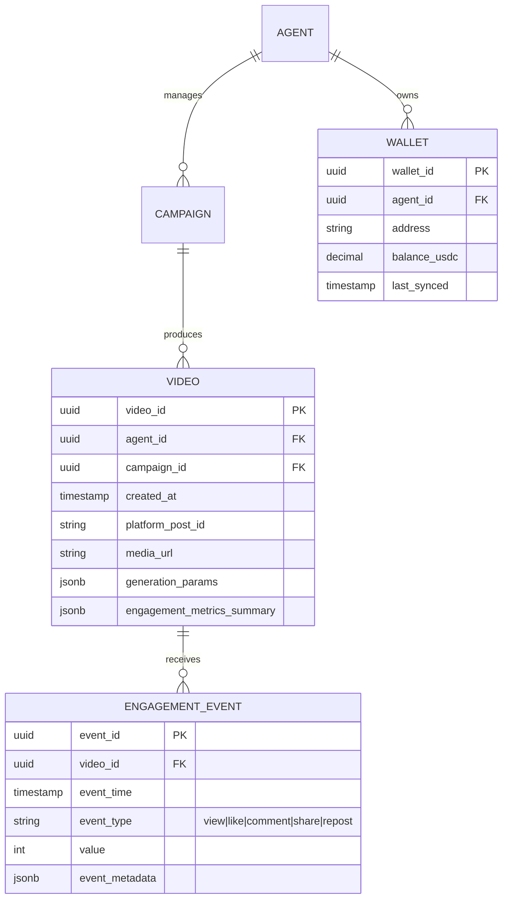

# Project Chimera: Domain Architecture Strategy

**Date:** February 05, 2026  
**Author:** Forward Deployed Engineer (FDE) Trainee

This document fulfills **Task 1.2** of the Project Chimera 3-Day Challenge. It is created **before any implementation code** and serves as a strategic plan based on the Software Requirements Specification (SRS), challenge guidelines, and research insights. All decisions prioritize reliability, governance, scalability, and strict adherence to Spec-Driven Development.

## 1. Agent Pattern Selection

### Chosen Pattern: FastRender Hierarchical Swarm (Planner → Worker → Judge)

The **FastRender Swarm** pattern defined in SRS §3.1 is the clear best fit.

#### Rationale

- Provides **parallel execution** via stateless Workers while maintaining strong governance through the Judge role.
- Enables **dynamic re-planning** (Planner reacts to new perceptions such as trends or mentions).
- Includes **built-in quality and safety gates** (Judge enforces persona, confidence thresholds, and can escalate or reject).
- Supports **optimistic concurrency control** (OCC) to prevent state conflicts.
- Explicitly designed for complex, multi-step tasks like multimodal content creation and engagement.

#### Rejected Alternatives

- **Sequential Chain**: Linear, fragile, no parallelism, and no dedicated quality layer — unsuitable for high-velocity autonomous workflows.
- **Pure Hierarchical Swarm (no defined roles)**: Lacks explicit governance and error recovery mechanisms.
- **Monolithic Agent**: Cannot scale and violates SRS requirements for swarm coordination.

This pattern directly supports the project's goal of self-healing, exception-based orchestration for a fleet of thousands of agents.

## 2. Human-in-the-Loop (HITL) – Safety Layer

### Placement: Integrated into the Judge Role (Confidence-Based Escalation)

HITL is positioned **exclusively within the Judge component**, as specified in SRS NFR 1.0–1.2.

#### Mechanism

- Every Worker output includes a `confidence_score` (0.0–1.0).
- Judge routing logic:
  - **> 0.90**: Auto-approve and commit to state.
  - **0.70–0.90**: Pause task and add to async HITL queue (agent continues other work).
  - **< 0.70**: Auto-reject and return to Planner for retry.
- **Mandatory escalation** for sensitive topics (politics, health, finance, misinformation) regardless of score.
- Humans interact via a dedicated Review Dashboard (Approve/Reject/Edit/Comment).

#### Why Here?

- Centralizes safety without bottlenecking high-confidence actions.
- Maximizes agent autonomy while ensuring brand, ethical, and legal compliance.
- Aligns with "management by exception" philosophy.

## 3. Data & Database Management Strategy

### 3.1 Database Choice Rationale

**Primary Database**: PostgreSQL 16 with TimescaleDB extension (v2.17+)  
**Complementary Systems**:

- Weaviate v1.26+ (vector database for semantic search and RAG)
- Redis 7+ (short-term cache, task queues, session state)
- S3-compatible object storage (e.g. AWS S3, MinIO, Cloudflare R2) for immutable video binaries

**Why PostgreSQL + TimescaleDB as primary**:

- Strong relational integrity (foreign keys, ACID transactions) — essential for linking agents → campaigns → videos → wallet balances → engagement events
- Efficient relational joins for cross-agent analytics and reporting
- TimescaleDB hypertables deliver near-NoSQL insert performance for high-velocity time-series data (engagement events: views/likes/comments per second across thousands of agents)
- Schema stability: metadata fields are well-defined and unlikely to change frequently
- Native support for JSONB (generation_params, engagement_metrics) with GIN indexing

**Why not pure NoSQL (e.g. MongoDB, Cassandra)**:

- Schema flexibility is unnecessary — metadata structure is stable and relational
- Weaker joins and consistency guarantees would complicate reliable campaign reporting and wallet transaction traceability
- Higher risk of eventual consistency issues during high-velocity writes

**Hybrid architecture benefits**:

- PostgreSQL/TimescaleDB: structured + time-series core
- Weaviate: vector embeddings for semantic search/RAG
- Redis: low-latency cache and ephemeral state
- S3: cheap, durable blob storage for videos → keeps relational DB lean

### 3.2 Database Schema & ERD (Video Metadata & Core Entities)

