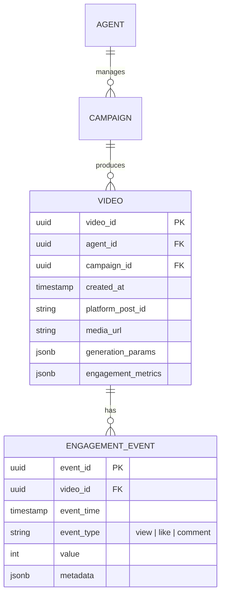

# DB & Data Management Specification

**Version:** 1.0  
**Date:** February 06, 2026

This specification defines the complete intent for data storage, structure, and flow. An AI agent can implement the full data layer from this document.

## 1. Database Choice & Rationale

- **Primary**: PostgreSQL with TimescaleDB extension (relational + time-series)
- **Vector DB**: Weaviate (semantic search on descriptions/transcripts)
- **Cache/Queue**: Redis (ephemeral state, queues)
- **Blob Storage**: S3 (video files)

Rationale: Hybrid for relational integrity + high-velocity handling. PostgreSQL for ACID/joins, TimescaleDB for time-series, Weaviate for RAG, Redis for speed, S3 for scale.

## 2. Schemas & ERD

